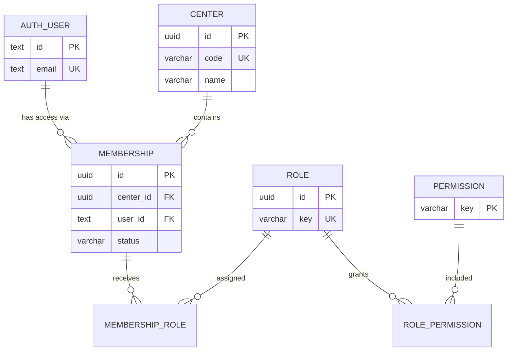
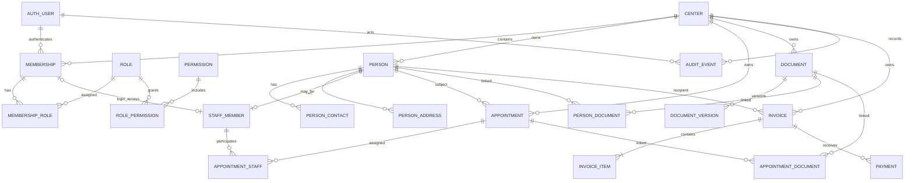

# Geplantes Datenbankmodell der Centersoftware

## Status und Zweck

**Planungsstand:** 2026-09-02  
**Charakter:** lebende technische Zielbild-Dokumentation  
**Verbindlichkeit:** Das bereits implementierte Fundament ist verbindlich. Alle als *geplant* oder *Option* markierten Bereiche sind Architekturvorschlaege und werden erst durch die jeweilige Migration kanonisch.

Dieses Dokument beschreibt das geplante relationale Datenmodell der Centersoftware. Es soll vor allem verhindern, dass Fachmodule isoliert entstehen und spaeter durch Mandantenfaehigkeit, Berechtigungen, Historisierung oder Querverbindungen wieder umgebaut werden muessen.

Die Kernregel lautet:

> Authentifizierung identifiziert einen Benutzer. Fachliche Daten werden ueber Center, Mitgliedschaften und explizite Berechtigungen erschlossen.

Neon ist der aktuelle PostgreSQL-Betreiber. Das Modell selbst bleibt normales PostgreSQL und soll ohne fachliche Neuentwicklung auf einen anderen PostgreSQL-Betrieb uebertragbar bleiben.

---

## 1. Statuslegende

| Kennzeichen | Bedeutung |
| --- | --- |
| **[IST]** | bereits im Code und in der Produktionsdatenbank vorhanden |
| **[NEXT]** | fuer die naechsten Fachmodule vorgesehen |
| **[LATER]** | spaeter sinnvoll, aber aktuell nicht migrationsreif |
| **[OPEN]** | fachliche oder regulatorische Entscheidung noch offen |

---

## 2. Grundprinzipien

### 2.1 Center ist die Mandantengrenze

`app.center` ist die kanonische organisatorische Einheit. Jedes fachliche Objekt, das einem Center gehoert, erhaelt einen **expliziten `center_id`-Bezug**.

Centergrenzen duerfen nicht aus dem angemeldeten Benutzer, aus URL-Zustaenden oder aus indirekten Beziehungen erraten werden. Die Datenbankabfrage muss den Centerkontext explizit kennen.

### 2.2 Auth-Identitaet ist keine Fachperson

`auth.user` beschreibt ein Login-Konto. Eine fachliche Person, ein Mitarbeiter oder spaeter ein Kunde/Klient/Patient ist ein davon getrenntes Domaenenobjekt.

Ein Mensch kann daher fachlich existieren, ohne ein Login zu besitzen. Umgekehrt darf ein technisches Benutzerkonto nicht automatisch als fachlicher Personenstammsatz interpretiert werden.

### 2.3 Rollen gelten pro Center

Ein Benutzer erhaelt Zugriff nicht direkt durch `auth.user`, sondern ueber:

```text
user
  -> membership
       -> membership_role
            -> role
                 -> role_permission
                      -> permission
```

Damit kann derselbe Benutzer in Center A Owner und in Center B lediglich Mitarbeiter sein.

### 2.4 Fachliche Beziehungen statt polymorpher Fremdschluessel

Wo immer moeglich sollen echte Fremdschluessel verwendet werden. Konstruktionen wie `entity_type + entity_id` sind fuer zentrale Fachdaten zu vermeiden, weil PostgreSQL dort keine referenzielle Integritaet erzwingen kann.

Beispiel: Dokumente werden spaeter ueber konkrete Relationstabellen mit Personen oder Terminen verbunden, statt einen beliebigen `object_id`-Verweis zu speichern.

### 2.5 Dateien gehoeren nicht als Blob in die Hauptdatenbank

Dokumentdateien, Scans und grosse Binärdaten sollen in einem geeigneten Object Storage liegen. PostgreSQL speichert Metadaten, Versionen, Hashes, Besitz- und Zugriffsbeziehungen sowie den Storage-Key.

### 2.6 Zeitangaben

Technische Zeitpunkte werden als PostgreSQL `timestamptz` und damit zeitzonenfaehig gespeichert. Die Anwendung stellt sie in der jeweiligen lokalen Zeitzone dar.

Reine Kalendertage ohne Uhrzeit, etwa ein Geburtsdatum, bleiben ein eigener Datumstyp und werden nicht kuenstlich zu Mitternachts-Zeitstempeln gemacht.

### 2.7 Loeschen ist eine fachliche Entscheidung

Es gibt kein pauschales `deleted_at` auf jeder Tabelle.

- kurzlebige technische Daten duerfen physisch geloescht werden;
- Join-Tabellen duerfen bei Aufloesung ihrer Beziehung geloescht werden;
- fachlich oder regulatorisch relevante Datensaetze benoetigen Status/Historie/Aufbewahrungsregeln;
- besonders schuetzenswerte personenbezogene Daten erhalten vor Produktivnutzung ein eigenes Loesch- und Aufbewahrungskonzept.

---

## 3. Aktuelles Datenbankfundament [IST]

### 3.1 Schema `auth`

Dieses Schema gehoert der Authentifizierungsschicht Better Auth. Fachmodule greifen nicht direkt auf Passwort- oder Sessiondaten zu.

| Tabelle | Aufgabe |
| --- | --- |
| `auth.user` | Login-Identitaet mit Name, E-Mail und Verifikationsstatus |
| `auth.session` | aktive bzw. ablaufende Sitzungen |
| `auth.account` | Credentials und spaetere externe Auth-Provider |
| `auth.verification` | temporaere Verifikationsdaten |

Wichtige Grenze: `auth.user.id` ist ein Auth-Identifier und kein fachlicher Personen- oder Mitarbeiter-Schluessel.

### 3.2 Schema `app`

| Tabelle | Aufgabe |
| --- | --- |
| `app.center` | Mandant / Center |
| `app.membership` | Zuordnung eines Login-Benutzers zu einem Center |
| `app.role` | stabile Rollen wie Owner, Admin, Staff |
| `app.permission` | stabile fachliche Berechtigungs-Keys |
| `app.membership_role` | n:m-Zuordnung Membership ↔ Rolle |
| `app.role_permission` | n:m-Zuordnung Rolle ↔ Berechtigung |

Aktuelle Permission-Domaenen:

- `center.*`
- `people.*`
- `staff.*`
- `appointments.*`
- `documents.*`
- `billing.*`
- `authorization.manage`

### 3.3 ER-Modell des aktuellen Fundaments



---

## 4. Zielbild auf Modulebene

Das mittelfristige Modell besteht aus sieben logischen Bereichen. Diese muessen nicht sofort sieben PostgreSQL-Schemas werden. Fuer den Start koennen Tabellen weiterhin in `app.*` liegen; eine spaetere Schema-Aufteilung ist nur bei echtem Nutzen vorgesehen.

```text
Authentication
    |
Organization / Authorization
    |
    +-- People
    +-- Staff
    +-- Appointments
    +-- Documents
    +-- Billing
    +-- Audit / Integration
```

---

## 5. Personenmodell [NEXT]

### 5.1 `app.person`

`person` wird der fachliche Personenstamm innerhalb eines Centers.

**Geplante Kernfelder:**

- `id`
- `center_id`
- interne Person-/Aktennummer optional
- Vorname
- Nachname
- Anzeigename optional
- Geburtsdatum optional
- Status
- `created_at`
- `updated_at`

**Entscheidung:** Personen sind zunaechst **centerlokal**. Dieselbe reale Person kann in zwei Centern zwei getrennte Datensaetze besitzen. Das verhindert unbeabsichtigte centeruebergreifende Identitaetsverkettung und Datenfreigabe.

Eine spaetere explizite Shared-Identity-Funktion waere ein separates Modell und kein automatisches Zusammenfuehren.

### 5.2 `app.person_contact`

Mehrere Kontaktwege pro Person:

- Telefon
- Mobil
- E-Mail
- weitere Kommunikationswege spaeter
- Kennzeichen fuer bevorzugten Kontakt
- Verifikations-/Gueltigkeitsstatus bei Bedarf

### 5.3 `app.person_address`

Mehrere zeitlich bzw. funktional unterscheidbare Adressen:

- Privat-/Post-/Rechnungsadresse
- Gueltigkeitszeitraum optional
- Land strukturiert
- Adresszeilen nicht auf deutsche Spezialfaelle fest verdrahten

### 5.4 Keine direkte Kopplung `person == auth.user`

Falls eine fachliche Person selbst ein Portal-/Benutzerkonto erhaelt, soll die Verknuepfung explizit erfolgen, voraussichtlich ueber eine kleine Relation wie `person_user`.

Damit bleiben folgende Faelle sauber moeglich:

- Person ohne Login
- Mitarbeiter mit Login
- externe Person mit spaeterem Portalzugriff
- Login ohne eigenen fachlichen Personenstamm

---

## 6. Mitarbeitermodell [NEXT]

### 6.1 `app.staff_member`

Ein Mitarbeiter ist eine centerbezogene fachliche Rolle einer Person, nicht dasselbe wie ein Login.

**Geplante Beziehungen:**

```text
center -> person -> staff_member
                 \-> optional membership -> auth.user
```

Geplante Inhalte:

- `id`
- `center_id`
- `person_id`
- optionale `membership_id`
- interne Personalnummer optional
- Funktions-/Berufsbezeichnung
- Aktivstatus
- Eintritt/Austritt optional

`membership` steuert den Softwarezugriff. `staff_member` beschreibt die fachliche Mitarbeitereigenschaft. Beides darf nicht vermischt werden.

### 6.2 Spaetere Erweiterungen [LATER]

Moegliche separate Tabellen, sobald fachlich erforderlich:

- `staff_qualification`
- `staff_team`
- `staff_team_member`
- `staff_working_time_rule`
- `staff_absence`

Diese gehoeren nicht vorsorglich in die erste Mitarbeitermigration.

---

## 7. Terminmodell [NEXT]

### 7.1 `app.appointment`

Der Termin ist ein centerbezogenes Ereignis mit eigenem Lebenszyklus.

Geplante Kerninhalte:

- `id`
- `center_id`
- optionale fachliche Terminart
- Start
- Ende
- Status
- Betreff/Kurzbezeichnung
- optionaler Ort/Raum
- Ersteller
- `created_at`
- `updated_at`

### 7.2 Teilnehmer

Statt nur einen einzelnen Mitarbeiter direkt in `appointment` zu speichern, wird fuer Mitarbeitende eine Relation vorgesehen:

- `app.appointment_staff`

Eine zentrale fachliche Person kann als `person_id` am Termin haengen. Falls spaeter mehrere externe/fachliche Teilnehmer benoetigt werden, wird eine weitere explizite Relation eingefuehrt.

### 7.3 Terminstatus

Statuswerte werden fachlich definiert, z. B. geplant, bestaetigt, durchgefuehrt, abgesagt. Sie sollen keine frei erfundenen UI-Texte sein.

### 7.4 Wiederkehrende Termine [OPEN]

Serientermine sind noch nicht kanonisch festgelegt. Vor einer Implementierung muss entschieden werden, ob wir:

1. jede Instanz materialisieren,
2. eine Recurrence-Regel plus Ausnahmen speichern,
3. oder eine hybride Loesung nutzen.

Fuer ein operatives System ist die hybride Variante wahrscheinlich am robustesten, sie wird aber erst mit konkreten Anforderungen festgelegt.

---

## 8. Dokumentmodell [NEXT]

### 8.1 `app.document`

Die Datenbank repraesentiert das fachliche Dokumentobjekt, nicht die Datei selbst.

Geplante Metadaten:

- `id`
- `center_id`
- Dokumentart
- Titel
- Status
- aktueller Versionsbezug
- Ersteller
- `created_at`
- `updated_at`

### 8.2 `app.document_version`

Dateien sollen versionierbar sein. Eine Version speichert unter anderem:

- `document_id`
- Versionsnummer
- Storage-Key
- Dateiname
- MIME-Type
- Dateigroesse
- kryptographischen Hash
- Upload-Zeitpunkt
- hochladenden Benutzer

Der Hash erlaubt Integritaetspruefung und hilft bei kontrollierter Duplikaterkennung.

### 8.3 Fachliche Dokumentbeziehungen

Keine polymorphe `object_type/object_id`-Tabelle fuer Kernbeziehungen.

Vorgesehen sind bei Bedarf konkrete Relationen wie:

- `app.person_document`
- `app.appointment_document`
- spaeter `app.invoice_document`

Damit bleiben Fremdschluessel pruefbar.

### 8.4 Dokumentinhalt und Datenschutz

Volltextindexierung, OCR-Texte und KI-abgeleitete Inhalte werden **nicht automatisch** Bestandteil der ersten Dokumentmigration. Fuer besonders schuetzenswerte Dokumente muss vorher geklaert werden, welche Inhalte ueberhaupt dauerhaft indexiert oder extrahiert werden duerfen.

---

## 9. Abrechnungsmodell [LATER]

Die Permission-Domaene `billing.*` existiert bereits, das Fachmodell selbst soll aber erst nach Klaerung der tatsaechlichen Abrechnungsprozesse festgeschrieben werden.

Voraussichtlicher Kern:

### `app.invoice`

- `id`
- `center_id`
- Rechnungsnummer
- Rechnungsempfaenger
- Rechnungsdatum
- Faelligkeitsdatum
- Status
- Netto-/Steuer-/Bruttosummen als gespeicherte Abrechnungsergebnisse
- Waehrung

### `app.invoice_item`

- `invoice_id`
- Positionsnummer
- Leistungstext
- Menge
- Einzelpreis
- Steuerlogik
- Positionssumme

### `app.payment`

- Zahlungseingang
- Betrag
- Datum
- Referenz
- Zahlungsweg

### Offene Punkte

Vor Umsetzung sind mindestens zu klaeren:

- welche konkreten Abrechnungsregeln gelten;
- ob externe Buchhaltungs-/Praxis-/ERP-Systeme federfuehrend sind;
- ob Rechnungsnummern centerbezogene Sequenzen benoetigen;
- welche Unveraenderbarkeits- und Aufbewahrungspflichten gelten;
- welche Storno-/Korrekturlogik benoetigt wird.

---

## 10. Audit und Nachvollziehbarkeit [NEXT/LATER]

### 10.1 Fachlicher Audit-Trail

Ein spaeteres `app.audit_event` soll sicherheits- und fachrelevante Aenderungen nachvollziehbar machen.

Moegliche Inhalte:

- `id`
- `center_id`
- Zeitpunkt
- `actor_user_id`
- Aktion
- betroffene Entitaet
- Entitaets-ID
- Request-/Correlation-ID
- minimale Aenderungsmetadaten

**Wichtig:** Ein Audit-Log soll nicht blind komplette Datensaetze mit sensiblen Inhalten duplizieren. Der Umfang wird pro Fachbereich definiert.

### 10.2 Technisches Logging ist nicht Audit

Application Logs, Vercel Logs und Datenbankdiagnostik sind technische Betriebsdaten. Sie ersetzen keinen dauerhaften fachlichen Audit-Trail.

---

## 11. Integrationen und asynchrone Verarbeitung [LATER]

Wenn spaeter E-Mail, externe Systeme, Dokumentverarbeitung oder andere asynchrone Prozesse hinzukommen, wird ein **Transactional-Outbox-Modell** bevorzugt.

Vorgesehene Tabelle:

- `app.outbox_event`

Eine fachliche Aenderung und das zu versendende Ereignis koennen damit in derselben Datenbanktransaktion geschrieben werden. Das verhindert den klassischen Fehler: Datenbank erfolgreich, externe Nachricht verloren.

Inbound-Integrationen benoetigen analog stabile externe IDs und Idempotency-Keys.

---

## 12. Geplantes Gesamt-ER-Modell

Das folgende Diagramm ist ein Zielbild, **kein bereits implementiertes Schema**.



---

## 13. Tenant-Isolation auf Datenbankebene

### 13.1 Jede relevante Tabelle traegt `center_id`

Auch wenn der Centerbezug theoretisch ueber mehrere Joins ableitbar waere, wird er auf wichtigen fachlichen Haupttabellen explizit gespeichert.

Vorteile:

- einfachere und sicherere Queries;
- bessere Indizierung;
- klarere Berechtigungspruefung;
- leichtere spaetere RLS-Regeln;
- geringeres Risiko centeruebergreifender Joins.

### 13.2 Centerbezogene Unique Constraints

Fachliche Nummern sind im Regelfall nicht global eindeutig, sondern pro Center.

Beispiele:

```text
(center_id, person_number)
(center_id, employee_number)
(center_id, invoice_number)
```

### 13.3 Indizes

Bei grossen centerbezogenen Tabellen beginnen typische Zugriffspfade mit `center_id` und danach mit dem fachlichen Filter bzw. Sortierfeld.

Indexe werden nicht vorsorglich fuer jede Spalte erzeugt. Sie werden aus konkreten Query-Pfaden und spaeter aus `EXPLAIN`-Messungen abgeleitet.

### 13.4 RLS [LATER]

PostgreSQL Row Level Security bleibt eine moegliche Defense-in-Depth-Schicht. Sie ersetzt die serverseitige Fachautorisierung nicht.

Vor RLS muessen Connection-Pooling, Transaktionskontext und sichere Weitergabe des Centerkontexts sauber definiert sein.

---

## 14. ID- und Referenzstrategie

### Anwendungstabellen

- UUID als technische Primaerschluessel
- fachliche Nummern separat und menschenlesbar
- fachliche Nummer nie als alleiniger Primaerschluessel

### Authentifizierung

- Better-Auth-IDs bleiben in ihrem nativen Format
- keine Zwangskonvertierung von `auth.user.id` auf UUID

### Externe Systeme

Externe IDs werden nie als eigener Primaerschluessel uebernommen. Stattdessen:

```text
internal UUID
+ source/system
+ external_id
```

mit geeigneter Unique Constraint pro Quelle.

---

## 15. Aenderungs- und Historisierungsstrategie

Nicht jede Tabelle benoetigt Vollhistorisierung.

Drei Muster werden unterschieden:

1. **aktueller Zustand** – normale Stammdaten, wenn alte Werte fachlich nicht benoetigt werden;
2. **fachliche Statushistorie** – wenn Statuswechsel nachvollziehbar sein muessen;
3. **versioniertes Objekt** – Dokumente oder andere Inhalte, deren vorherige Versionen erhalten bleiben muessen.

Ein generisches "History fuer alles" soll vermieden werden. Es erzeugt viel Datenmenge, ohne automatisch fachliche Nachvollziehbarkeit zu liefern.

---

## 16. Was bewusst nicht vermischt wird

| Nicht vermischen | Grund |
| --- | --- |
| `auth.user` und `person` | Login-Identitaet ist kein Personenstamm |
| `membership` und `staff_member` | Softwarezugriff ist keine Beschaeftigungseigenschaft |
| Rolle und Permission | Rollen sind konfigurierbare Buendel stabiler Rechte |
| Dokument und Datei | fachliches Objekt soll mehrere Dateiversionen tragen koennen |
| Audit und technische Logs | unterschiedliche Zwecke und Aufbewahrung |
| Center und Standort/Raum | ein Center kann spaeter mehrere Orte besitzen |
| UI-Status und fachlicher Status | Fachzustand muss auch ohne aktuelle UI konsistent bleiben |

---

## 17. Voraussichtliche Migrationsreihenfolge

### Phase 0 – Foundation **[IST]**

- `auth.*`
- Center
- Membership
- Rollen
- Permissions

### Phase 1 – People & Staff **[NEXT]**

1. `person`
2. `person_contact`
3. `person_address`
4. `staff_member`
5. optionale Person↔User-Verknuepfung

### Phase 2 – Appointments **[NEXT]**

1. `appointment`
2. `appointment_staff`
3. Terminarten/Orte erst, wenn die UI-Anforderungen feststehen

### Phase 3 – Documents **[NEXT]**

1. `document`
2. `document_version`
3. konkrete Dokumentrelationen
4. Storage-Anbindung

### Phase 4 – Audit / Integration **[NEXT/LATER]**

1. Audit-Events fuer festgelegte kritische Aktionen
2. Outbox fuer externe Prozesse

### Phase 5 – Billing **[LATER]**

Erst nach fachlicher Klaerung der Abrechnungsprozesse und regulatorischen Anforderungen.

---

## 18. Anforderungen an jede neue Tabelle

Vor einer Migration muss fuer jede neue fachliche Tabelle beantwortet sein:

1. Wem gehoert der Datensatz – welchem `center_id`?
2. Wer darf lesen, erstellen, aendern oder loeschen?
3. Ist das Objekt ein Stammdatensatz, Ereignis, Zustand oder Version?
4. Welche Eindeutigkeit gilt global und welche nur innerhalb eines Centers?
5. Welche Beziehungen brauchen echte Foreign Keys?
6. Was geschieht beim Loeschen eines referenzierten Objekts?
7. Welche Zeitpunkte muessen nachvollziehbar bleiben?
8. Enthalten die Daten personenbezogene oder besonders schuetzenswerte Informationen?
9. Welche Aufbewahrungs-/Loeschregeln gelten?
10. Welche Queries sind die wahrscheinlichen Hauptzugriffe und welche Indizes folgen daraus?
11. Muss die Aenderung auditierbar sein?
12. Gibt es externe Systeme, die stabile Import-/Export-IDs benoetigen?

---

## 19. Offene Architekturentscheidungen

Folgende Fragen werden bewusst noch nicht vorschnell im Schema festgeschrieben:

- genaue Semantik des Personenfachmoduls und seine branchenspezifischen Felder;
- Mehrfachstandorte/Raeume innerhalb eines Centers;
- Terminserien und Ressourcenplanung;
- fachliche Dokumentklassifikation und Aufbewahrung;
- Abrechnungslogik und externe Finanzsysteme;
- RLS als zusaetzliche Sicherheitsstufe;
- Such-/Volltextarchitektur fuer Dokumente und Personen;
- Archivierung sehr alter Daten;
- centeruebergreifende Datenfreigaben;
- Portal-/Extranet-Zugriffe fuer externe Personen.

Diese Punkte sollen erst entschieden werden, wenn die jeweilige Fachanforderung konkret genug ist. Das verhindert ein uebermodelliertes Datenbankschema mit spekulativen Tabellen.

---

## 20. Zielzustand

Das Datenmodell soll langfristig folgende Aussage erzwingen koennen:

```text
Wer ist der Benutzer?
    -> auth.user / session

Auf welches Center darf er zugreifen?
    -> membership

Was darf er dort tun?
    -> role / permission

Welche fachliche Person oder Mitarbeiterrolle ist betroffen?
    -> person / staff_member

Welches konkrete Fachobjekt wird bearbeitet?
    -> appointment / document / invoice / ...

Ist dieses Objekt demselben Center zugeordnet?
    -> expliziter center_id-Bezug

Muss die Aenderung nachvollziehbar bleiben?
    -> fachlicher Status / Version / Audit Event
```

Damit bleibt die Architektur auch dann beherrschbar, wenn aus der heutigen Foundation eine deutlich groessere Multi-Center-Anwendung mit Personen-, Termin-, Dokument- und Abrechnungsdaten entsteht.
